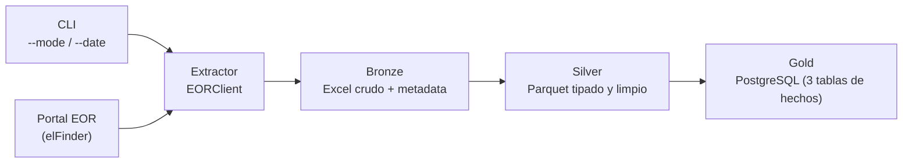

# ETL_MER_PREDESPACHO
automatizacion de proceso ETL de los datos publicos del portal EOR, seccion Predespacho

Pipeline ETL end-to-end que automatiza la extracción, transformación y
disponibilización de los reportes de **Predespacho** publicados por el
**Ente Operador Regional (EOR)** del Mercado Eléctrico Regional
centroamericano, aplicando arquitectura de datos en capas (medallón:
Bronze → Silver → Gold) y persistiendo el modelo final en PostgreSQL para
consulta de negocio.

## CONTEXTO DEL CASO

El EOR publica, en su portal público (`enteoperador.org`), reportes
históricos y diarios de Predespacho para los 6 países del MER (Guatemala,
El Salvador, Honduras, Nicaragua, Costa Rica y Panamá), comprimidos en
archivos ZIP organizados por fecha. Este proyecto:

1. Descarga automáticamente esos archivos (soportando carga diaria
   incremental y backfill histórico).
2. Extrae las hojas **TCP**, **TOP** y **PEXANTE** de cada reporte, para
   todos los países disponibles.
3. Modela y persiste la información en 3 capas (Bronze, Silver, Gold),
   dejando el dato final consultable en PostgreSQL mediante SQL estándar.

## ARQUITECTURA GENERAL 



**Bronze** — copia fiel del Excel tal como llega del portal, particionado
por fecha y país, junto con un `_metadata.json` de trazabilidad
(URL origen, fecha de carga, país). Cero transformación de contenido.

**Silver** — lee las hojas TCP/TOP/PEXANTE, normaliza nombres de columna
(snake_case, sin acentos), tipa los datos, y homologa el código de país a
un nombre legible. Se persiste como Parquet particionado por
`tipo_reporte/fecha/país` — mismo grano que Bronze, sin consolidar
archivos (ver sección de Decisiones de Diseño).

**Gold** — modelo dimensional en PostgreSQL: dimensiones compartidas de
fecha y país, más **3 tablas de hechos** (`fact_tcp`, `fact_top`,
`fact_pexante`), una por tipo de reporte, dado que cada uno tiene grano y
columnas de negocio distintos (ver Decisiones de Diseño para el porqué).

## ESTRUCTURA DEL PROYECTO

edecsa_predespacho/
├── main.py                     # Punto de entrada CLI (--mode daily|backfill)
├── requirements.txt            # Dependencias del proyecto
├── .env.example                # Plantilla de variables de entorno (sin valores reales)
├── .gitignore                  # Excluye .env, __pycache__, data/, logs/
├── README.md
├── sql/
│   └── schema.sql              # DDL del esquema Gold (dimensiones + 3 tablas de hechos)
├── src/
│   ├── config/
│   │   └── settings.py         # Carga y valida configuración desde .env
│   ├── extractor/
│   │   ├── eor_client.py       # Cliente HTTP del connector elFinder (hash, listado, descarga)
│   │   ├── fid_resolver.py     # Decide fid=reciente vs fid=histórico según la fecha
│   │   └── exceptions.py       # EORExtractionError, EORFileNotFoundError, EORNetworkError
│   ├── processing/
│   │   ├── zip_processor.py    # Descompresión recursiva ZIP principal → ZIP país → Excel
│   │   ├── bronze_writer.py    # Persistencia cruda + metadata de trazabilidad (capa Bronze)
│   │   ├── silver_transformer.py  # Limpieza, tipado y homologación (capa Silver)
│   │   └── gold_builder.py     # Despacha e inserta en la tabla de hechos correcta (capa Gold)
│   ├── db/
│   │   └── postgres_repository.py  # Única clase que ejecuta SQL contra PostgreSQL
│   ├── orchestration/
│   │   └── pipeline.py         # Orquesta Extract→Bronze→Silver→Gold; modos daily/backfill
│   └── utils/
│       └── logger.py           # Logging centralizado (consola + archivo)
├── data/
│   ├── bronze/                 # Salida capa Bronze (excluida de Git, se genera en ejecución)
│   └── silver/                 # Salida capa Silver (excluida de Git, se genera en ejecución)
└── logs/                       # Logs de ejecución (excluidos de Git)

**Nota sobre `__init__.py`:** cada carpeta dentro de `src/` (`config/`,
`extractor/`, `processing/`, `db/`, `orchestration/`, `utils/`) contiene
un archivo `__init__.py` vacío, necesario para que Python las reconozca
como paquetes importables. Se omiten del árbol anterior por brevedad.
 
**Nota sobre `data/` y `logs/`:** estas carpetas se generan
automáticamente la primera vez que se ejecuta el pipeline; solo se
versiona su estructura vacía (`.gitkeep`), nunca su contenido real (ver
`.gitignore`).
 
## INSTALACION
 
### Requisitos previos
 
- Python 3.12 o superior
- PostgreSQL 15+ instalado y corriendo localmente (o accesible por red)
- Git
### 1. Clonar el repositorio
 
```bash
git clone <URL-del-repositorio>
cd edecsa_predespacho
```
 
### 2. Crear y activar un entorno virtual
 
```bash
python -m venv .venv
 
# Windows (PowerShell):
.venv\Scripts\Activate.ps1
 
# Mac/Linux:
source .venv/bin/activate
```
 
### 3. Instalar dependencias
 
```bash
pip install -r requirements.txt
```
 
### 4. Configurar variables de entorno
 
Copia la plantilla y completa los valores reales (especialmente las
credenciales de PostgreSQL):
 
```bash
# Windows:
copy .env.example .env
 
# Mac/Linux:
cp .env.example .env
```
 
Edita `.env` y ajusta al menos `DB_PASSWORD` con la contraseña real de tu
instancia de PostgreSQL. El resto de valores por default ya corresponden
a los parámetros confirmados del portal EOR (ver sección de Supuestos).
 
### 5. Crear la base de datos
 
El proyecto no crea la base de datos en sí (solo el esquema y las tablas
dentro de ella). Créala una vez, manualmente:
 
```sql
-- Conectado a PostgreSQL (psql, pgAdmin, etc.)
CREATE DATABASE predespacho;
```
 
El esquema `gold` y sus tablas se crean automáticamente la primera vez
que se ejecuta `main.py` (ver `PostgresRepository.ensure_schema()`), no
requieren ningún script manual adicional.
 
## EJECUCION (SCRIPTS PARA CARGA DIARIA Y BACKFILL)
 
### Carga diaria (incremental)
 
Sin argumentos de fecha, procesa **el día siguiente a hoy** por default:
 
```bash
python main.py --mode daily
```
 
Con una fecha específica:
 
```bash
python main.py --mode daily --date 2026-09-10
```
 
### Carga histórica (backfill)
 
Procesa un rango de fechas inclusivo. Es idempotente: si se corre dos
veces sobre el mismo rango, las fechas ya cargadas exitosamente se omiten
automáticamente (columna `estado='OK'` en `gold.control_carga`).
 
```bash
python main.py --mode backfill --start-date 2019-01-01 --end-date 2019-01-31
```
 
### Verificar que la carga funcionó
 
```sql
-- ¿Qué fechas están cargadas y en qué estado?
SELECT * FROM gold.control_carga ORDER BY fecha_reporte DESC;
 
-- Conteo de filas por país y tipo de reporte
SELECT p.nombre_pais, COUNT(*) AS filas
FROM gold.fact_top f
JOIN gold.dim_pais p ON p.country_id = f.country_id
GROUP BY p.nombre_pais;
```

## SUPUESTOS SOBRE EL PORTAL EOR

Todo lo listado aquí fue **confirmado mediante ingeniería inversa e inspección manual** contra el portal real 
y un Excel real descargado, no son suposiciones sin verificar.

### Acceso público, sin autenticación

El portal expone un apartado de **"Solicitud de Acceso a la Información"**
que podría confundirse con un requisito de autenticación. Se confirmó que
este es un canal de transparencia/derecho de acceso (análogo a un FOIA)
para información que el EOR **no** ha publicado proactivamente. La
sección de Predespacho, bajo *"Informes Públicos de Procesos
Comerciales"*, es de acceso público directo: se validó descargando
archivos reales sin sesión ni credenciales.

### Motor del explorador de archivos: WP File Manager (elFinder)

El explorador de archivos del portal es el plugin de WordPress
**"WP File Manager"**, que expone el protocolo **elFinder 2.0** a través
de un front controller de WordPress:

```
GET /?red_fm_connect=true&front=user&fid=<id>&cmd=<comando>&...
```

Comandos relevantes identificados:
- `cmd=open&target=<hash>` — lista el contenido de una carpeta (JSON).
- `cmd=file&target=<hash>&download=1` — descarga un archivo puntual.

### Cálculo determinístico del hash de archivo

El "hash" que usa elFinder para referenciar un archivo **no es aleatorio**
— es determinístico y se calcula así:

```
hash = "l1_" + base64_estándar(nombre_del_archivo, sin padding "=")
```

Confirmado exhaustivamente: para el archivo `PUB004-PRE-20190409.zip`, el
hash calculado (`l1_UFVCMDA0LVBSRS0yMDE5MDQwOS56aXA`) coincidió
exactamente con el capturado manualmente del tráfico de red del portal.
Esto permite construir la URL de descarga directamente a partir de una
fecha, sin necesidad de listar la carpeta primero.

### Patrón de nombres de archivo

- **ZIP principal** (uno por fecha): `PUB004-PRE-YYYYMMDD.zip`
- **ZIP anidado** (uno por país, dentro del principal):
  `PUB004-PRE-YYYYMMDD-OSO00X.zip`
- **Excel** (dentro del ZIP de país): `PUB004-PRE-YYYYMMDD-OSO00X-XXXXXX.xlsx`,
  donde el último grupo de 6 dígitos es un sufijo variable **no
  predecible** (hipótesis: hora de generación del reporte, formato
  `HHMMSS`). Por esta razón, el `ZipProcessor` no intenta construir el
  nombre completo del Excel: localiza el país por el nombre del ZIP
  anidado (que sí es predecible) y luego busca cualquier `.xlsx` dentro.

### Dos rangos de fechas con `fid` distinto

El portal separa el contenido de Predespacho en dos carpetas con
identificadores (`fid`) diferentes:

| Carpeta | `fid` | Rango de fechas |
|---|---|---|
| "Predespacho" | `97` | `2019-01-01` → fecha actual |
| "Histórico" | `454` | `2013-01-01` → `2019-04-09` |

Existe un pequeño solape entre `2019-01-01` y `2019-04-09` presente en
ambas carpetas. La regla adoptada (`FidResolver`) resuelve siempre a favor
de `fid_reciente` (`97`) para fechas `>=` a la fecha de corte, ya que es
la fuente única para todo lo posterior.

### Estructura real de las hojas del Excel (TCP, TOP, PEXANTE)

Cada archivo Excel trae **14 hojas en total**; solo `TCP`, `TOP` y
`PEXANTE` son relevantes para este proyecto (las demás se ignoran).
Hallazgos confirmados al inspeccionar un archivo real:

- Cada hoja tiene un **bloque de membrete** (título, fecha del reporte)
  antes de los datos reales. El encabezado verdadero está en la **fila 8
  visible en Excel** (índice 7, 0-based, tal como lo espera `pandas`).
- Existen columnas en blanco a la izquierda (`Unnamed: 0`, a veces
  también `Unnamed: 1`) producto del espaciado visual de la plantilla;
  se descartan en Silver.
- La columna `Periodo` es la hora del día, en rango `0`–`23`; se renombra
  a `hora` para el resto del pipeline.
- No se encontraron valores nulos ni filas de "totales"/basura al final
  de ninguna hoja.
- El grano real (clave natural que hace única cada fila) es distinto por
  hoja — ver sección de Decisiones de Diseño para el detalle y su
  implicación en el modelo Gold:
  - **PEXANTE:** `Periodo + Nodo`
  - **TOP:** `Periodo + Nodo + Agente + Punto Medida`
  - **TCP:** `Periodo + Nodo + Agente + Código Contrato Firme + Tipo Transacción + Punto Medida`

### Observación pendiente de validar con más datos históricos

En las corridas de prueba, el país Panamá (`OSO006`) mostró consistentemente
0 filas en la hoja `TOP` en varias fechas consecutivas, mientras que TCP y
PEXANTE sí traían datos normalmente. No se confirmó si esto es un patrón
de negocio real (ausencia de transacciones de oportunidad programada para
ese país) o una particularidad del periodo de prueba; se documenta como
observación abierta, no como un defecto conocido del extractor.

## DECISIONES DE DISEÑO
 
### Por qué arquitectura medallón (Bronze/Silver/Gold)
 
Cada capa tiene una única responsabilidad y un único tipo de
transformación permitido, lo que hace trazable exactamente en qué punto
se limpia, tipa o modela cada dato:
 
- **Bronze** preserva el dato exactamente como llega (auditoría / poder
  reprocesar desde cero si una regla de negocio cambia).
- **Silver** aplica limpieza y tipado genérico, sin lógica de negocio
  específica del modelo final.
- **Gold** aplica modelado dimensional, pensado para consumo directo por
  SQL/BI.
### Por qué Parquet en Silver, no Excel ni CSV
 
El formato de origen (Excel) es apto para que un humano lo abra
manualmente, no para que un pipeline lo procese en cadena día tras día.
Parquet es columnar, tipado a nivel binario, comprimido, y es el estándar
de facto en arquitecturas medallón reales (Databricks, Spark, Azure
Synapse) — el mismo patrón que usaría este pipeline si migrara de disco
local a Azure Data Lake Storage (ADLS), cambiando solo las rutas por un
cliente de almacenamiento en la nube, sin tocar la lógica de negocio.
 
### Por qué Silver NO consolida archivos por fecha o país
 
Silver mantiene el mismo particionado granular que Bronze (un Parquet por
fecha + país + tipo de reporte), en vez de un archivo consolidado por
país u otra dimensión. Consolidar un archivo grande obligaría a
reescribirlo completo cada vez que se agrega un solo día nuevo — lento,
riesgoso ante fallas a medio proceso, y contrario al patrón estándar de
particionado tipo Hive que usan Spark/Athena/Databricks. Herramientas
como `pandas`/`pyarrow` pueden leer una carpeta particionada completa como
si fuera un único DataFrame cuando se necesita una vista consolidada
(`pd.read_parquet(carpeta)`), sin pagar el costo de mantenerla
físicamente unida. La consolidación real para el usuario de negocio
ocurre en Gold, vía SQL.
 
### Por qué 3 tablas de hechos en Gold, no una genérica
 
Se investigó la estructura real de las 3 hojas y se encontró que TCP
(26 columnas), TOP (19 columnas) y PEXANTE (3 columnas) tienen **grano y
forma de negocio distintos** — no son variaciones de un mismo hecho. Se
evaluaron dos opciones:
 
- *(A, adoptada)* Una tabla de hechos por tipo de reporte
  (`fact_tcp`, `fact_top`, `fact_pexante`), con columnas reales tipadas.
- *(B, descartada)* Una tabla genérica con columnas comunes (`hora`,
  `nodo`, `precio_exante`) y el resto de columnas específicas en un campo
  `JSONB`.
Se adoptó la Opción A porque prioriza la consulta SQL directa y tipada
para el usuario de negocio, a costa de más tablas y algo más de código
de carga. La Opción B tenía sentido como salvaguarda conservadora antes
de conocer la estructura real del Excel; una vez confirmada, ya no ofrece
ventaja suficiente para justificar perder tipado y capacidad de consulta
directa.
 
### Por qué Nodo y Agente NO se modelan como dimensiones propias
 
Se evaluó normalizar `Nodo` y `Agente` en tablas `dim_nodo`/`dim_agente`, 
pero se decidió mantenerlos como columnas directas en las tablas de hechos 
(denormalizado) porque:
 
- El EOR no publica ningún catálogo de referencia con atributos
  adicionales sobre nodos o agentes (nombre de subestación, tipo de
  agente, etc.) — sin esos atributos, una dimensión de solo-ID no aporta
  normalización real, solo una capa extra de `JOIN`s.
- Ambos tienen alta cardinalidad (cientos de nodos, decenas de agentes),
  a diferencia de dimensiones pequeñas y estables como país (6 valores).
- Modelarlos como dimensión implicaría lookups adicionales de upsert por
  cada fila cargada — relevante en TOP, con +100,000 filas por
  país/fecha.
Si el EOR llegara a publicar un catálogo de nodos/agentes con atributos
propios, esta decisión debería revisarse.
 
### Criterio para decidir `.env` vs. constante en código
 
No todo parámetro "del portal" va a `.env`, ni todo dato "de negocio" va
al código. El criterio aplicado fue:
 
> Va a `.env` si cambiar solo el valor (sin tocar código) mantiene el
> pipeline funcionando correctamente. Va al código si cambiar el valor
> real implicaría, de todos modos, escribir o modificar lógica en otro
> lado.
 
Bajo este criterio:
 
- **En `.env`** (ajustes mecánicos aislados): `EOR_VOLUME_ID`,
  `EOR_FID_RECIENTE`/`EOR_FID_HISTORICO`, `EOR_FID_CUTOFF_DATE`,
  `EOR_REPORT_PREFIX`, `EOR_COUNTRY_CODES`, `EOR_HEADER_ROW`,
  credenciales de base de datos, rutas locales.
- **En código** (cambios reales implican cascada de lógica):
  `REQUIRED_SHEETS` (agregar una hoja nueva requiere lógica de limpieza
  y modelo Gold propios), `COLUMN_RENAMES` y `COUNTRY_NAME_MAP`
  (convención interna / conocimiento de negocio estable, no un parámetro
  de ambiente).

### Programación orientada a objetos y responsabilidad única
 
Cada clase tiene una única responsabilidad y no conoce la implementación
interna de las demás (`EORClient` no sabe de Postgres; `PostgresRepository`
no sabe de ZIPs). Todas las dependencias se inyectan por constructor, y
`main.py` actúa como único *composition root* del proyecto — el único
lugar donde se decide qué implementación concreta de cada clase se
utiliza. Esto permite, por ejemplo, sustituir PostgreSQL por otro motor
sin tocar `Pipeline`, `GoldBuilder`, ni ningún otro módulo.
 
### Manejo de errores por niveles de severidad
 
Se definió una jerarquía propia de excepciones (`EORExtractionError` →
`EORFileNotFoundError` / `EORNetworkError`) para distinguir un archivo no
publicado (esperado, no es una falla) de un problema real de red/servidor.
A nivel de `Pipeline`, se aplican dos severidades distintas:
 
- Un fallo en la **descarga o descompresión del ZIP principal** detiene
  el procesamiento de toda esa fecha (no hay nada que procesar).
- Un fallo al procesar **un país individual** (Silver/Gold) se registra
  en el log y se omite, sin detener los demás países de esa fecha.
Esto se refleja en `gold.control_carga` con tres estados posibles:
`OK` (todos los países cargaron), `PARCIAL` (algunos fallaron) y `ERROR`
(la fecha completa falló).
 
### Idempotencia
 
Tanto a nivel de fila (`ON CONFLICT ... DO NOTHING` sobre las claves
naturales de cada tabla de hechos) como a nivel de fecha
(`gold.control_carga` + chequeo `fecha_ya_cargada()` antes de cada fecha
en un backfill), correr el pipeline más de una vez sobre el mismo rango
no duplica datos ni vuelve a descargar/reprocesar fechas ya cargadas
exitosamente.

## Limitaciones conocidas
 
Estas son las limitaciones conscientes del alcance actual:
 
- **Sin reintentos automáticos ante fallos de red transitorios.** Si
  `EORNetworkError` ocurre (timeout, error 5xx del servidor), esa fecha
  se marca `ERROR` en `control_carga` y el pipeline continúa con la
  siguiente; no hay lógica de *retry* con backoff. Un backfill re-corrido
  después sí reintentará esa fecha específica (gracias a la
  idempotencia), pero no ocurre automáticamente dentro de la misma
  ejecución.
- **Sin control de velocidad de peticiones (*throttling*) al portal.**
  Un backfill de rango amplio (por ejemplo, todo el histórico desde 2013)
  no introduce pausas entre descargas. En un uso intensivo real, valdría
  la pena agregar un límite de peticiones por segundo para no sobrecargar
  el portal del EOR ni arriesgarse a un bloqueo temporal por parte de su
  infraestructura.
- **Sin pruebas automatizadas (unit tests).** La validación de cada
  componente se hizo de forma manual e incremental contra el portal y
  archivos reales durante el desarrollo (documentado en el historial de
  commits), pero no existe una suite de tests automatizados (`pytest` o
  similar) ni integración continua (CI) que las ejecute en cada cambio.
- **Backfill secuencial, no paralelo.** Cada fecha se procesa una tras
  otra. Para rangos históricos muy amplios (años de backfill), el tiempo
  total de ejecución podría beneficiarse de paralelizar la descarga
  y/o el procesamiento de fechas independientes entre sí.
- **Gestión de secretos simplificada.** Las credenciales de PostgreSQL
  viven en un archivo `.env` local (no versionado). Es apropiado para el
  alcance de esta prueba, pero en un entorno productivo real (como el
  stack de EDECSA con Azure) se esperaría un mecanismo de secretos
  administrado, como Azure Key Vault.
- **Dependencia estricta de la estructura exacta del template del EOR.**
  El pipeline asume nombres de columna, número de hojas y fila de
  encabezado estables. Si el EOR modifica su plantilla de Excel (agrega/
  renombra una columna de negocio, cambia la fila de encabezado), el
  pipeline fallará de forma explícita (`SilverTransformationError` o
  `KeyError`) en vez de continuar silenciosamente con datos incompletos
  — comportamiento deliberado ("fail-fast"), pero requeriría ajuste
  manual del código ante un cambio real del portal.
- **Semántica de negocio de columnas no validada con un experto de
  dominio.** Columnas como los "Bloques de oferta 1-5" o los distintos
  valores de `Tipo Transacción`/`Tipo Contrato` se preservan tal cual las
  entrega el EOR, sin una interpretación de negocio validada más allá de
  lo inferible por su nombre — recomendable confirmarlo con un experto
  del área comercial de EDECSA antes de un uso analítico crítico.
- **Observación no resuelta: TOP con 0 filas para Panamá (OSO006).**
  Documentado en la sección de Supuestos; no se determinó con certeza si
  es un patrón de negocio real o una particularidad del periodo de
  prueba observado.
- **Sufijo numérico del nombre del Excel no confirmado oficialmente.**
  Se documenta como hipótesis (posible hora de generación del reporte,
  formato `HHMMSS`), sin confirmación directa por parte del EOR.
- **Sin catálogo de nodos/agentes.** Como se documentó en Decisiones de
  Diseño, `Nodo` y `Agente` se mantienen como identificadores sin
  atributos descriptivos adicionales, porque el EOR no publica un
  catálogo de referencia para ellos.