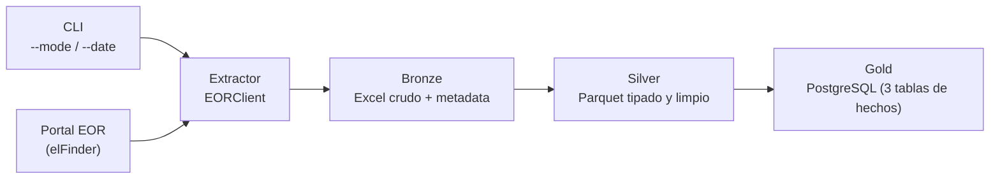

# ETL_MER_PREDESPACHO
automatizacion de proceso ETL de los datos publicos del portal EOR, seccion Predespacho

Pipeline ETL end-to-end que automatiza la extracción, transformación y
disponibilización de los reportes de **Predespacho** publicados por el
**Ente Operador Regional (EOR)** del Mercado Eléctrico Regional
centroamericano, aplicando arquitectura de datos en capas (medallón:
Bronze → Silver → Gold) y persistiendo el modelo final en PostgreSQL para
consulta de negocio.

## Contexto del caso

El EOR publica, en su portal público (`enteoperador.org`), reportes
históricos y diarios de Predespacho para los 6 países del MER (Guatemala,
El Salvador, Honduras, Nicaragua, Costa Rica y Panamá), comprimidos en
archivos ZIP organizados por fecha. Este proyecto:

1. Descarga automáticamente esos archivos (soportando carga diaria
   incremental y backfill histórico).
2. Extrae las hojas **TCP**, **TOP** y **PEXANTE** de cada reporte, para
   todos los países disponibles.
3. Modela y persiste la información en 3 capas (Bronze, Silver, Gold),
   dejando el dato final consultable en PostgreSQL mediante SQL estándar.

## Arquitectura general

**Bronze** — copia fiel del Excel tal como llega del portal, particionado
por fecha y país, junto con un `_metadata.json` de trazabilidad
(URL origen, fecha de carga, país). Cero transformación de contenido.

**Silver** — lee las hojas TCP/TOP/PEXANTE, normaliza nombres de columna
(snake_case, sin acentos), tipa los datos, y homologa el código de país a
un nombre legible. Se persiste como Parquet particionado por
`tipo_reporte/fecha/país` — mismo grano que Bronze, sin consolidar
archivos (ver sección de Decisiones de Diseño).

**Gold** — modelo dimensional en PostgreSQL: dimensiones compartidas de
fecha y país, más **3 tablas de hechos** (`fact_tcp`, `fact_top`,
`fact_pexante`), una por tipo de reporte, dado que cada uno tiene grano y
columnas de negocio distintos (ver Decisiones de Diseño para el porqué).